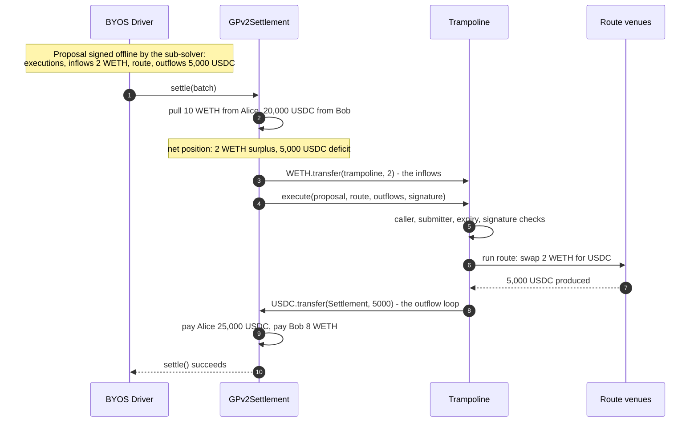
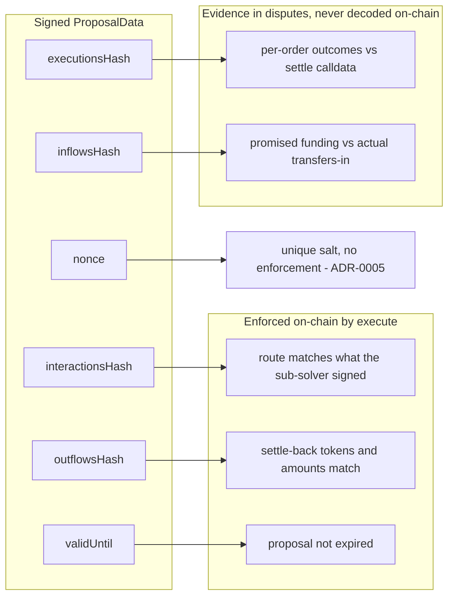

# Batch proposals: net token flows for multi-order settlements

Status: proposed

> Supersedes, once accepted: the single-order proposal schema of
> [ADR-0005](0005-trampoline-execution-authority.md) and the per-trade value flow of
> [ADR-0003](0003-trampoline-deployment-settlement-integration.md). Leaves intact:
> one sub-solver per settlement tx ([ADR-0004](0004-penalty-schedule-and-attribution.md)),
> the submitter gate and execution authority (ADR-0005), the funding-guard principle
> (ADR-0003), and residue disposition ([ADR-0008](0008-residue-disposition.md)).

## Context

CoW Protocol's core mechanism is the batch auction: a solver settles many orders in
one `settle()`, orders on the same token pair clear at uniform prices, and opposing
orders net peer-to-peer (a CoW) so only the residual imbalance touches on-chain
liquidity. `GPv2Settlement` nets internally — users are paid from the settlement's
commingled balance, so interactions only need to cover the net deficit per token, not
each trade's gross amounts.

The current proposal schema is single-order: one `orderUidHash`, one
`sellAmount`/`buyAmount`, and an `execute` that settles back one exact amount of one
BYOS-supplied `_buyToken`. ADR-0003 sketched multi-order settlements as "repeat
transfer-in + `execute` per trade" and deferred the order-count question to ADR-0004;
ADR-0004 resolved only the sub-solver count. Repeating the per-trade flow amortizes
settlement overhead but runs every route on gross amounts — the netting surplus, the
part of the batch-auction value proposition that wins auctions, stays out of reach.

Nothing is deployed (no broadcast artifacts in the repo), so a schema change costs a
typehash and a domain-version bump, not a migration.

## Decision

### Net-flow model: one proposal per settlement, covering N orders

A proposal commits to a whole settlement's worth of orders and describes the
trampoline's role in *net* terms:

- **inflows** — the per-token net surplus the settlement holds after pulling all
  users' sell amounts, transferred into the instance by BYOS-authored interactions
  (the generalization of today's step 1);
- the **route** — the sub-solver's raw interactions converting that surplus into
  what the batch is short of, unchanged from ADR-0005;
- **outflows** — the per-token net deficit, settled back to `GPv2Settlement` by
  trampoline contract code as exact-amount transfers (the generalization of today's
  settle-back).

Volume that CoWs between orders never touches the trampoline; `GPv2Settlement` nets it
internally. A batch of one degenerates to today's flow exactly, so there is a single
schema and a single `execute` path — the old typehash is retired, not kept alongside.

ADR-0003's buffer-safety argument carries over: per token, the net surplus is at most
what the users' sell transfers just pulled in, so inflows are always trade capital in
transit — a settlement can never legitimately require funding the trampoline from
BYOS's own buffer.

### Worked example

Alice sells 10 WETH for USDC; Bob sells 20,000 USDC for WETH; both clear at 2,500
USDC per WETH (fees ignored). Alice is owed 25,000 USDC, Bob is owed 8 WETH. After
pulling both sell amounts the settlement holds 10 WETH against 8 owed (surplus 2) and
20,000 USDC against 25,000 owed (deficit 5,000). The 8 WETH and 20,000 USDC that CoW
never leave the settlement; only the residual crosses the trampoline.



A shortfall anywhere in the outflow loop reverts the whole settlement, exactly as the
single-order funding guard does today.

### Signed schema

```solidity
struct ProposalData {
    bytes32 executionsHash;   // keccak256(abi.encode(executions))
                              //   Execution = (bytes orderUid,
                              //                uint256 sellAmount, uint256 buyAmount)
    bytes32 inflowsHash;      // keccak256(abi.encode(inflows))
                              //   TokenFlow = (address token, uint256 amount)
    bytes32 interactionsHash; // unchanged (ADR-0005)
    bytes32 outflowsHash;     // keccak256(abi.encode(outflows)), TokenFlow entries
    uint256 validUntil;       // unchanged
    uint256 nonce;            // unchanged
}
```

All three new fields follow the `interactionsHash` pattern — a keccak of the
abi-encoded list — rather than EIP-712 nested struct arrays. Same binding power,
less hashing code in the hot path, and one established convention instead of two.

**`executionsHash` is required.** Net flows constrain the sums, not the split. BYOS
builds the `settle()` calldata, so without a signed per-order record BYOS could shift
surplus between users or violate EBBO while the signature still verifies — and EBBO
debits land on the sub-solver. This is the same inverted threat model that made
`interactionsHash` mandatory in ADR-0005: anything the sub-solver is liable for must
be under its signature. A dispute hashes the execution tuples, checks them against the
signature, and compares them with the on-chain `settle()` calldata; any deviation is
provably BYOS's, any match is provably the sub-solver's. The trampoline never decodes
the list — it is evidence, the role `orderUidHash` plays today. It also gives Track B
per-order attribution: one batch can accrue several EBBO certificates, each traceable
to a signed tuple.

**`inflowsHash` is evidence, not enforcement.** It replaces the signed `sellAmount`.
The funding guard remains the outflow transfers' own insufficient-balance reverts
(ADR-0003): underfunding any inflow — including funding token A but not token B —
ends in an atomic revert, and the signed inflow list proves whose deviation caused it.
No `balanceOf` loop before the route.

**`outflowsHash` is enforced.** `execute` recomputes it from the outflow array in
calldata — the same array it then transfers from — so a settle-back that differs from
what the sub-solver signed fails signature verification. This is stronger than today:
`_buyToken` was BYOS-supplied and unsigned, so BYOS could point the settle-back at a
token the instance held only as residue. With outflows under the signature, that
vector closes and the `_buyToken` parameter disappears.

The `execute` signature becomes:

```solidity
function execute(
    Proposal calldata _proposal,      // executionsHash, inflowsHash, validUntil, nonce
    Interaction[] calldata _interactions,
    TokenFlow[] calldata _outflows,
    bytes calldata _signature
) external;
```

with `interactionsHash` and `outflowsHash` recomputed on-chain and the rest of the
checks unchanged: settlement-only caller, submitter gate on `tx.origin`, `validUntil`
expiry, ECDSA recovery to `SUB_SOLVER`.

What each signed field buys, and where it is checked:



### Settle-back loop: dumb by design

The outflow loop transfers each entry's exact amount, with `BUY_ETH_ADDRESS` valid per
entry for native ETH. No length cap, no duplicate-token check, no zero-amount check:
the block gas limit bounds size, the collateral gate below vets batches before they
exist, and the sub-solver signed the array. Duplicates transfer twice; zero amounts
no-op. Every validation rule would be hot-path code guarding against inputs the only
affected party already consented to.

### Fully-netted settlements still call the trampoline

When every order CoWs perfectly, the route, inflows, and outflows are all empty and
the trampoline has no economic role. `execute` is still included — it verifies the
signature and loops over nothing. This preserves ADR-0004's attribution mechanism (the
CREATE2 address in calldata self-evidences the sub-solver, with no reliance on BYOS's
records) and one uniform invariant for monitors and the solver engine: every BYOS
settlement contains exactly one trampoline call. The cost is one signature
verification plus the submitter-gate staticcalls.

### Collateral: per-proposal gate replaces the static minimum

ADR-0004 sized the minimum escrow balance to the worst case of a *single* settlement
(`gas + c_l`). Batches make worst-case gas a function of batch size, so the static
minimum becomes a per-proposal check: the gatekeeper accepts a batch only if the
sub-solver's balance covers that batch's worst-case Track A — its gas estimate plus
`c_l`. Larger batches require larger balances automatically; small sub-solvers keep
the low entry barrier for single-order proposals. Track B is unchanged:
under-collateralized by nature, defended by gatekeeping and freeze-then-investigate.
This is off-chain policy plus this record — `debit()` already takes an arbitrary
amount.

### Generation and versioning

The EIP-712 domain version bumps from `"0.1"` to `"0.2"` with the new typehash, so
signatures from the two schemas can never be confused. Per ADR-0005 a generation is
anchored by its Escrow (which deploys the factory, which anchors the domain); with
nothing deployed, this is a change in place, not a migration.

## Non-goals

- **Multi-sub-solver settlements.** ADR-0004's one-sub-solver rule stands; a batch is
  one sub-solver's solution to many orders, which matches CoW's one-winner auction.
- **Partially fillable orders.** The sub-solver signs exact executed amounts, as
  today. Letting BYOS choose fills at settle time is out of scope; the execution-tuple
  schema accommodates it later (the sub-solver would sign its chosen fill).
- **Fee-on-transfer buy tokens.** Still excluded (ADR-0003); the exact-amount rule now
  applies per outflow entry.

## Alternatives considered

- **N single-order proposals per settlement (gross flows).** No contract change —
  ADR-0003's sketch. Amortizes fixed settlement overhead but every route runs gross,
  so CoWs between orders yield no surplus. Rejected: it skips the part of batching
  that wins auctions. Remains valid as calldata (each proposal is a batch of one) but
  is strictly dominated by one net-flow proposal.
- **Sign clearing prices instead of executions.** Binds `(tokens[], prices[])`, closer
  to GPv2's own model. Equivalent for fill-or-kill orders, but partial-fill amounts
  are a free calldata parameter — a BYOS deviation there reverts the settlement and
  debits a sub-solver who has no signed record of intended fills. Rejected.
- **Net flows only (no `executionsHash`).** Smallest struct, but the sub-solver
  becomes liable for per-user outcomes it never committed to — the fabricated-fault
  hole ADR-0005 closed, reopened. Rejected as inconsistent with the trust model.
- **Dual schema (`execute` for v1 + `executeBatch`).** Preserves outstanding
  signatures at the cost of two typehashes, two verify paths, and two settle-back
  paths in the security-critical contract. Rejected; there are no outstanding
  signatures worth preserving.
- **On-chain array validation (length cap, dedup, zero checks).** Earlier failures
  and a tidier evidence trail, but every rule is hot-path code guarding inputs the
  sub-solver signed. Rejected.
- **EIP-712 nested struct arrays for flows.** Standard-compliant typed data
  (`TokenFlow[]` with its own typehash), better wallet rendering. Rejected for
  consistency with the existing hashed-blob convention and less on-chain hashing;
  sub-solvers sign programmatically, not in wallets.
- **Static minimum with a batch-size cap, or a per-order scaled minimum.** Simpler
  policy, but the cap strands surplus for well-capitalized sub-solvers and the scaled
  minimum adds a declared parameter to keep in sync. Rejected for the per-proposal
  gate.

## Consequences

- Netting surplus becomes reachable, which is the point: BYOS solutions can now score
  on CoWs, not just routing.
- All outstanding v0.1 signatures are invalidated by the typehash and domain-version
  change; sub-solver clients must sign the new struct against domain `0.2`.
  Acceptable pre-deployment.
- Evidence custody is symmetric but off-chain for two fields: the execution and
  inflow lists exist as hashes on-chain, and both parties hold the preimages (the
  sub-solver signed them; BYOS stored them at gatekeeping). Route and outflows remain
  fully on-chain calldata.
- The gatekeeper takes on batch validation: execution tuples must be internally
  consistent (uniform clearing prices per token pair, sums matching the net flows)
  and the per-proposal collateral check replaces the static minimum. Proposal API,
  gatekeeper, and solver-engine calldata builder all change; those live with the BYOS
  service.
- Residue semantics are unchanged (ADR-0008), with two shifts: multi-token batches
  diversify what accumulates, and the signed outflows close the unsigned-`_buyToken`
  path by which a settlement could pull residue. Replay posture is unchanged — the
  submitter gate blocks third parties, `validUntil` bounds BYOS-side replay.
- ADR-0003's value flow reads per-batch instead of per-trade; the funding guard is
  unchanged in kind, now enforced once per outflow token.
