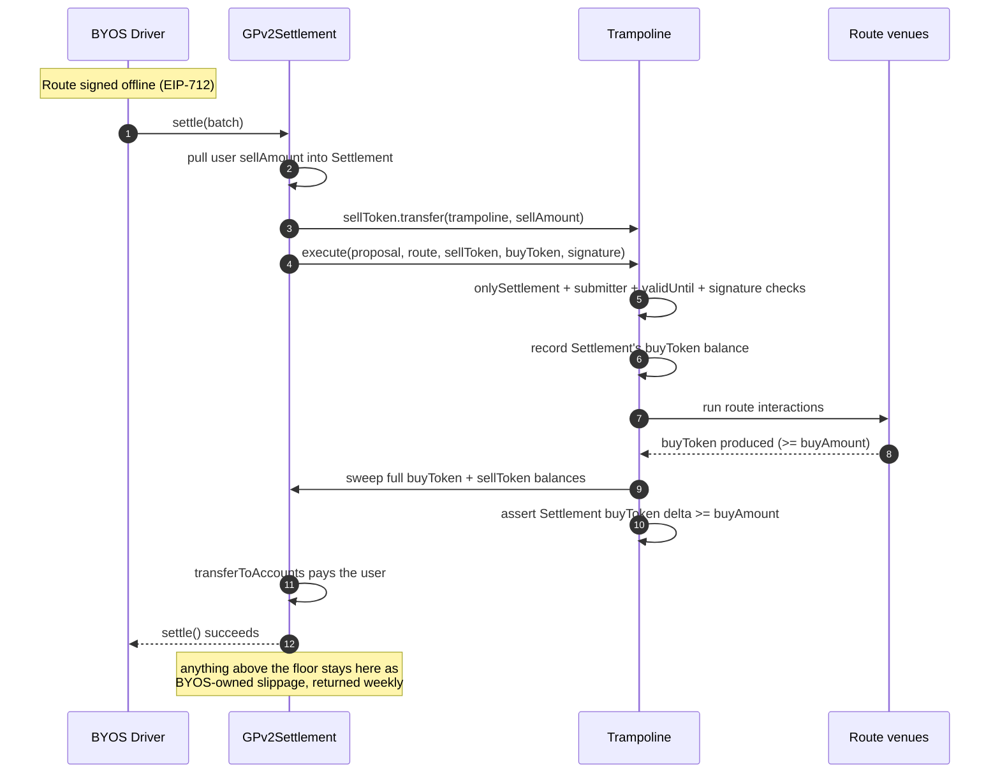
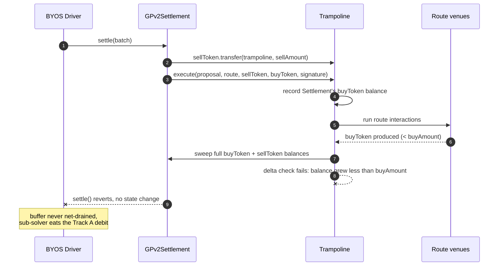
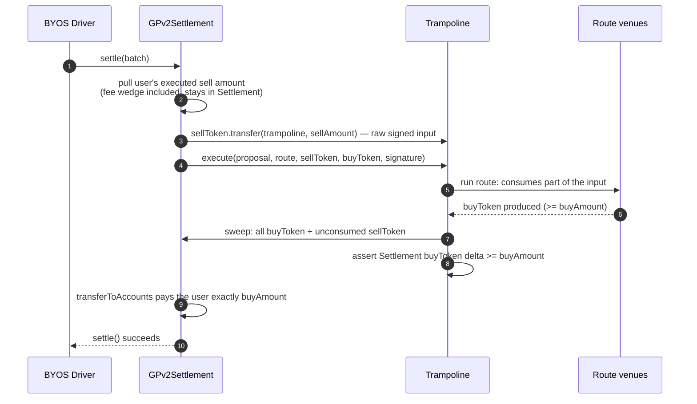

# Order flow: settlement through a trampoline

How a single order flows through `GPv2Settlement` and a sub-solver's `Trampoline`
instance, and how the outcomes differ. Complements
[ADR-0003](adr/0003-trampoline-deployment-settlement-integration.md) (value flow, funding
guard) and [ADR-0008](adr/0008-residue-disposition.md) (surplus custody).

> Describes the revised design of 2026-07-22: `buyAmount` is a floor enforced by a
> balance-delta check, and the instance sweeps both trade tokens back to the Settlement.
> The Trampoline contract rework to match is a follow-up implementation PR.

## Actors

- **BYOS Driver** — builds and submits the settlement, authoring the funding transfer and
  the `execute` call.
- **GPv2Settlement** — CoW's settlement contract. Holds funds; runs intra-interactions as
  itself.
- **Trampoline** — the sub-solver's instance. Fund-less at rest, no allowance over the
  Settlement.
- **Route venues** — the DEXes the route hits.
- **Sub-solver** — signs the route offline (EIP-712), never executes on-chain.

The funding transfer and `execute` are separate interactions because they run in
different `msg.sender` contexts: the transfer-in runs as the Settlement (which owns the
funds), the route runs as the Trampoline. That split keeps the route from ever holding
the Settlement's spend authority.

Inside `execute`, the trampoline records the Settlement's buy-token balance, runs the
sub-solver's route, sweeps its own full remaining balance of both trade tokens to the
Settlement, and reverts unless the Settlement's buy-token balance grew by at least
`buyAmount` — the signed floor. The sweep and the check are trampoline contract code;
the sub-solver supplies only the route.

---

## Happy path: route delivers at least the floor

The route produces at least `buyAmount` of buy token. The sweep pushes everything the
instance holds back to the Settlement, the delta check passes, the Settlement pays the
user, and BYOS's buffer nets to zero. Anything above the floor is not stranded and not
sub-solver property: it sits in the Settlement as BYOS-owned slippage, returned by CoW's
weekly accounting.

A route may also deliver output to the Settlement directly instead of to the instance;
the delta check measures what the Settlement actually received, so both shapes pass.

---

## Shortfall: route delivers less than the floor

The delta check fails and reverts the whole settlement. No trade, BYOS's buffer
untouched. The revert threshold is the same as the old exact-amount transfer — below
`buyAmount` nothing settles — but the guard is now an explicit assertion on the
Settlement's balance growth, not the transfer's own insufficient-balance revert.

---

## Buy order: unconsumed input comes back

Same mechanism, different slack. A buy order fixes the user's output, so the input is
over-provisioned: the full signed `sellAmount` is pushed in, the route consumes only what
it needs, and the sweep returns the unconsumed sell token to the Settlement along with
the output. The delta check is identical — the Settlement's buy-token balance must grow
by at least the floor, which for a buy order covers the user's exact `buyAmount`.

Where the fee wedge sits for each order kind, with worked numbers, is in
[docs/reference/cow-fee-collection.md](reference/cow-fee-collection.md).

---

## The outcomes at a glance

| Route delivery vs floor | Delta check | Settlement | Extras (surplus, unconsumed input) |
| --- | --- | --- | --- |
| Exactly the floor | passes | succeeds | none |
| Above the floor | passes | succeeds | swept to the Settlement; BYOS-owned slippage, returned weekly |
| Below the floor | reverts | reverts | n/a — no trade |

The sweep and the delta check are trampoline contract code parameterized by the
BYOS-supplied tokens and the signed floor, not sub-solver interactions — a malicious
sub-solver cannot omit or redirect them. The instance ends every settlement holding none
of the trade tokens, so ADR-0001's "the instance is not a wallet" is literal: a planted
approval over an empty contract drains nothing.
