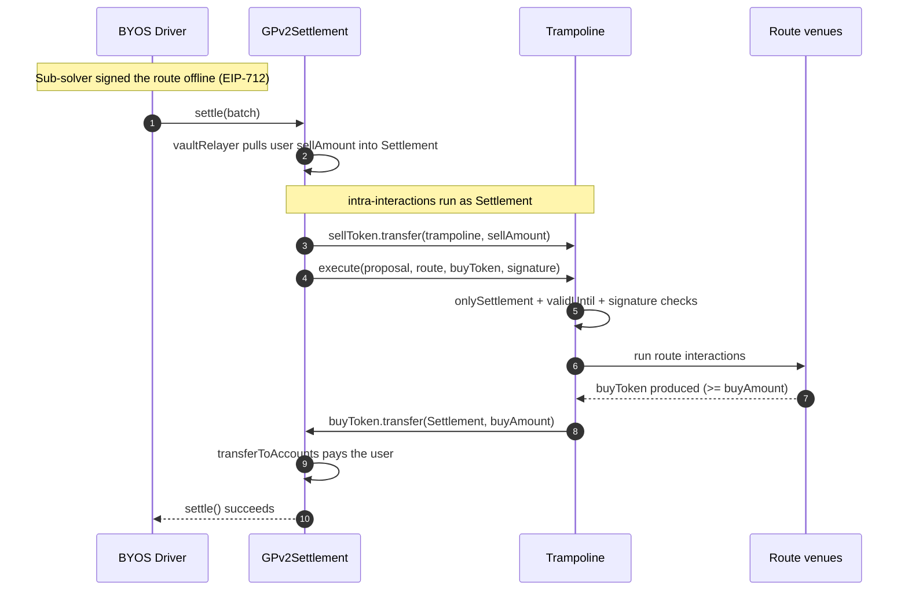
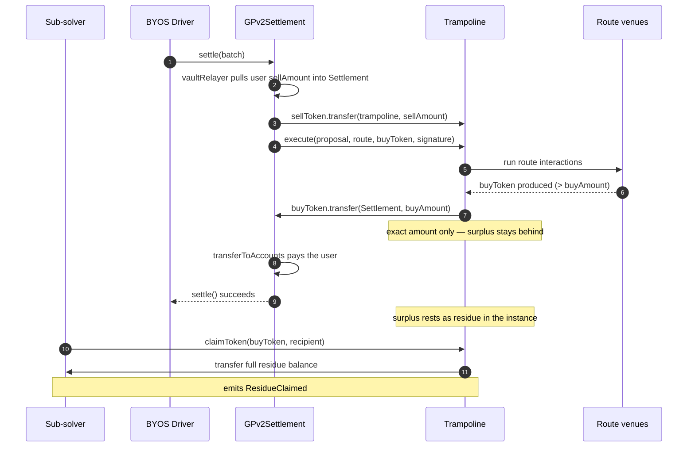

# Order flow: settlement through a trampoline

How a single order flows through `GPv2Settlement` and a sub-solver's `Trampoline`
instance, and how the three outcomes differ. Diagrams complement the text in
[ADR-0003](adr/0003-trampoline-deployment-settlement-integration.md) (settlement value
flow, funding guard) and [ADR-0008](adr/0008-residue-disposition.md) (residue).

## Actors

- **BYOS Driver** — builds and submits the settlement; authors the value-moving
  interactions (the funding transfer and the `execute` call).
- **GPv2Settlement** — CoW's settlement contract. Holds funds; runs intra-interactions
  as itself.
- **Trampoline** — the sub-solver's own instance. Fund-less at rest, no allowance over
  the Settlement.
- **Route venues** — the DEXes the sub-solver's route interacts with.
- **Sub-solver** — signs the route offline (EIP-712); never executes on-chain during
  settlement.

The funding transfer and the settle-back are two separate interactions because they run
in two different `msg.sender` contexts: the transfer-in runs as the Settlement (which
owns the funds), and `execute` runs as the Trampoline. That split is what keeps the
sub-solver's route from ever holding the Settlement's spend authority.

---

## Happy path: route delivers at least `buyAmount`

The route produces enough buy token. The trampoline sends back exactly `buyAmount`, the
Settlement pays the user, and BYOS's buffer nets to zero.



---

## Shortfall: route delivers less than `buyAmount`

The route came up short. The settle-back transfer has insufficient balance and reverts,
which reverts the whole settlement. No trade happens and BYOS's buffer is untouched — the
transfer's own revert is the funding guard (no separate balance check).

```mermaid
sequenceDiagram
    autonumber
    participant D as BYOS Driver
    participant S as GPv2Settlement
    participant T as Trampoline
    participant R as Route venues

    D->>S: settle(batch)
    S->>S: vaultRelayer pulls user sellAmount into Settlement
    S->>T: sellToken.transfer(trampoline, sellAmount)
    S->>T: execute(proposal, route, buyToken, signature)
    T->>R: run route interactions
    R-->>T: buyToken produced (< buyAmount)
    T--xS: buyToken.transfer(Settlement, buyAmount)<br/>reverts: ERC20InsufficientBalance
    S--xD: settle() reverts — no state change
    Note over D: BYOS buffer never net-drained;<br/>sub-solver eats the Track A debit
```

Covered by `test_execute_reverts_when_route_produces_less_than_buy_amount` and the fuzz
test `testFuzz_execute_settles_back_iff_route_output_covers_buy_amount` in
`test/Trampoline/Trampoline.t.sol`.

---

## Surplus: route delivers more than `buyAmount`

The route overdelivers. The trampoline still sends back exactly `buyAmount` — the surplus
stays in the instance as residue, which the sub-solver reclaims later in their own
transaction. Residue is the sub-solver's property, outside the collateral model
([ADR-0008](adr/0008-residue-disposition.md)).



The residue path is exercised by `test_execute_leaves_surplus_in_instance_as_residue` in
`test/Trampoline/Trampoline.t.sol`. Operational note (ADR-0008): the instance is not a
wallet — claim promptly and keep `validUntil` short, since unclaimed residue is exposed
to allow-listed-solver replay until the proposal expires.

---

## The three outcomes at a glance

| Route output vs `buyAmount` | Settle-back | Settlement | Sub-solver residue |
| --- | --- | --- | --- |
| Equal | sends `buyAmount` | succeeds | none |
| Greater | sends `buyAmount` | succeeds | surplus, claimable |
| Less | reverts | reverts | n/a (no trade) |

The settle-back is trampoline contract code parameterized by BYOS-supplied
`(buyToken, buyAmount)`, not a sub-solver interaction — so a malicious sub-solver cannot
omit or redirect it (see `Trampoline.execute`, `src/contracts/Trampoline.sol:82-87`).
