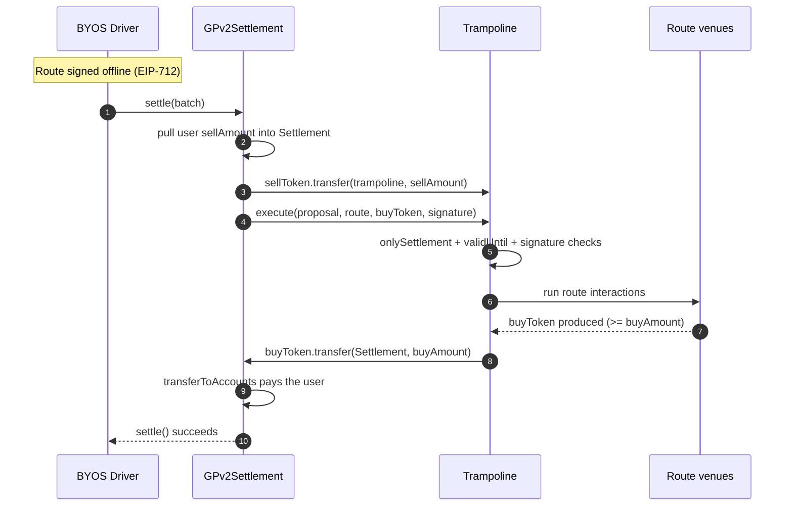
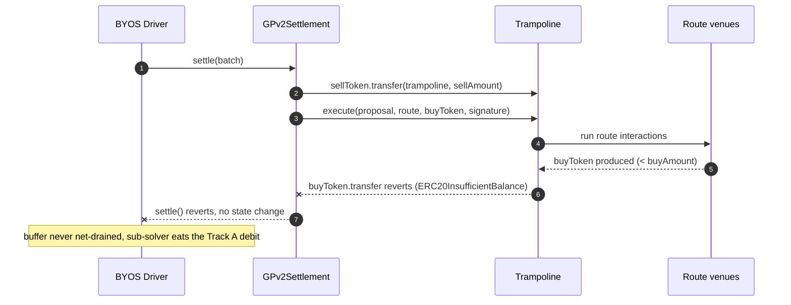
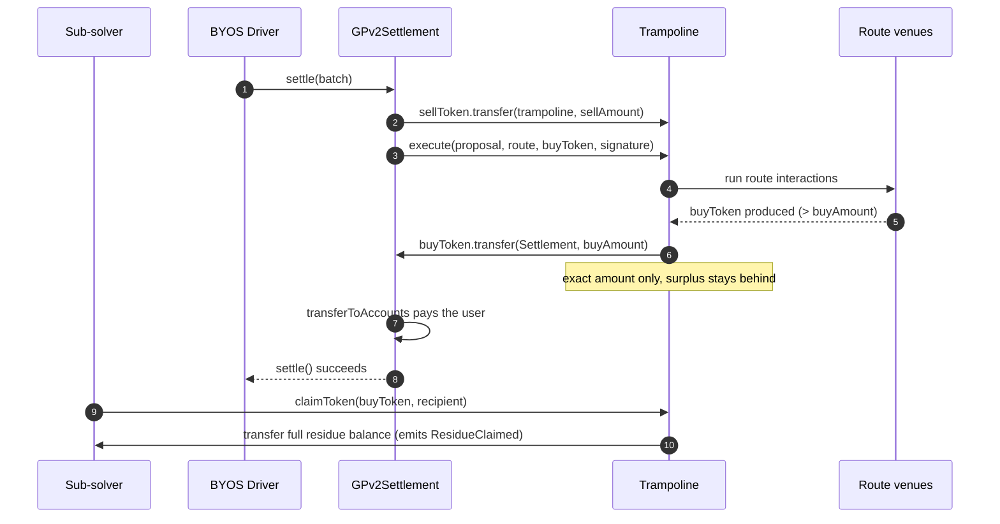

# Order flow: settlement through a trampoline

How a single order flows through `GPv2Settlement` and a sub-solver's `Trampoline`
instance, and how the three outcomes differ. Complements
[ADR-0003](adr/0003-trampoline-deployment-settlement-integration.md) (value flow, funding
guard) and [ADR-0008](adr/0008-residue-disposition.md) (residue).

## Actors

- **BYOS Driver** — builds and submits the settlement, authoring the funding transfer and
  the `execute` call.
- **GPv2Settlement** — CoW's settlement contract. Holds funds; runs intra-interactions as
  itself.
- **Trampoline** — the sub-solver's instance. Fund-less at rest, no allowance over the
  Settlement.
- **Route venues** — the DEXes the route hits.
- **Sub-solver** — signs the route offline (EIP-712), never executes on-chain.

The funding transfer and the settle-back are separate interactions because they run in
different `msg.sender` contexts: the transfer-in runs as the Settlement (which owns the
funds), `execute` runs as the Trampoline. That split keeps the route from ever holding the
Settlement's spend authority.

---

## Happy path: route delivers at least `buyAmount`

Route produces enough buy token, trampoline sends back exactly `buyAmount`, Settlement
pays the user, BYOS's buffer nets to zero.

---

## Shortfall: route delivers less than `buyAmount`

The settle-back transfer has insufficient balance and reverts, reverting the whole
settlement. No trade, BYOS's buffer untouched — the transfer's own revert is the funding
guard, no separate balance check.

Covered by `test_execute_reverts_when_route_produces_less_than_buy_amount` and the fuzz
test `testFuzz_execute_settles_back_iff_route_output_covers_buy_amount` in
`test/Trampoline/Trampoline.t.sol`.

---

## Surplus: route delivers more than `buyAmount`

Trampoline still sends back exactly `buyAmount`. The surplus stays as residue, which the
sub-solver reclaims later in their own transaction. Residue is the sub-solver's property,
outside the collateral model ([ADR-0008](adr/0008-residue-disposition.md)).

Exercised by `test_execute_leaves_surplus_in_instance_as_residue` in
`test/Trampoline/Trampoline.t.sol`. Operational note (ADR-0008): the instance is not a
wallet — claim promptly and keep `validUntil` short, since unclaimed residue is exposed to
allow-listed-solver replay until the proposal expires.

---

## The three outcomes at a glance

| Route output vs `buyAmount` | Settle-back | Settlement | Sub-solver residue |
| --- | --- | --- | --- |
| Equal | sends `buyAmount` | succeeds | none |
| Greater | sends `buyAmount` | succeeds | surplus, claimable |
| Less | reverts | reverts | n/a (no trade) |

The settle-back is trampoline contract code parameterized by BYOS-supplied
`(buyToken, buyAmount)`, not a sub-solver interaction — so a malicious sub-solver cannot
omit or redirect it (see `Trampoline.execute`, `src/contracts/Trampoline.sol:82-87`).
