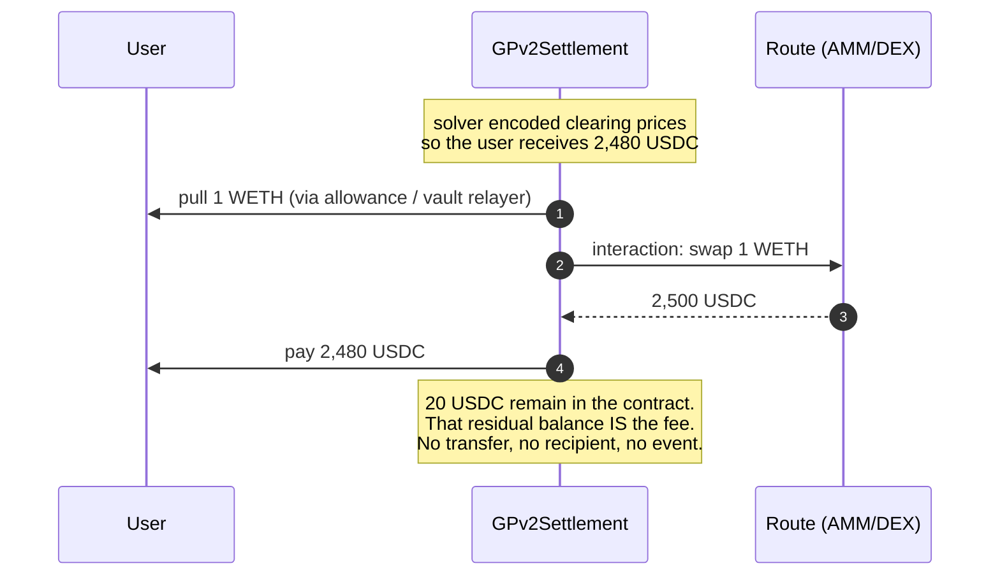
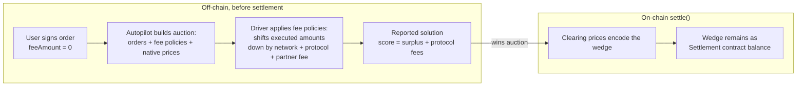
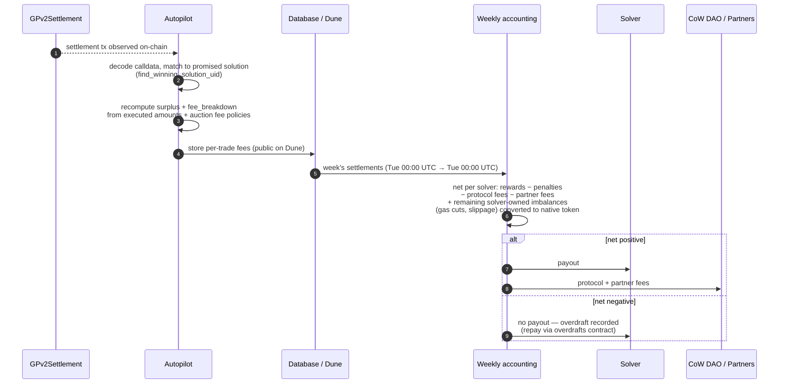
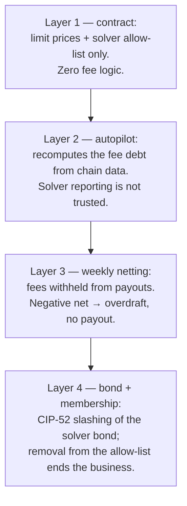

# CoW Protocol — Fee Collection & Enforcement (reference)

> Consolidated from the official docs, the settlement contract source, and the autopilot code.
> Captured 2026-07-21 while analyzing fee handling for BYOS. Sources:
> [settlement contract docs](https://docs.cow.fi/cow-protocol/reference/contracts/core/settlement),
> [accounting](https://docs.cow.fi/cow-protocol/reference/core/auctions/accounting),
> [rewards](https://docs.cow.fi/cow-protocol/reference/core/auctions/rewards),
> [governance fees](https://docs.cow.fi/governance/fees),
> [`GPv2Settlement.sol`](https://github.com/cowprotocol/contracts/blob/main/src/contracts/GPv2Settlement.sol),
> [`autopilot/src/domain/fee`](https://github.com/cowprotocol/services/blob/main/crates/autopilot/src/domain/fee/mod.rs),
> [`autopilot/src/domain/settlement`](https://github.com/cowprotocol/services/blob/main/crates/autopilot/src/domain/settlement/mod.rs).
>
> Why this matters for BYOS: separating the fee is the **solver's job**, done by pricing, not by
> the contract. In BYOS the executed amounts are signed by the sub-solver, so the fee wedge is
> under sub-solver control — see the BYOS section at the end and ADR-0009.

## The one-sentence model

There is no fee logic on-chain. A fee is a **price wedge**: the solver pays the user slightly
less than the trade produced, the difference stays in `GPv2Settlement`'s balance, and once a week
the protocol computes off-chain who owes what and settles up.

## Fee types

| Fee | What it covers | Who receives it | How the amount is set |
|---|---|---|---|
| Network fee | Gas of the settlement | The solver (it keeps its own cut) | Solver's own cut, typically in the sell token; the protocol does **not** reimburse gas |
| Protocol fee | CoW DAO revenue | CoW DAO | Fee policies attached to each order by the autopilot (surplus %, volume %, price improvement) |
| Partner fee | Integrator revenue | The partner | Declared in the order's appData, capped by the protocol |

Orders sign `feeAmount = 0` since the 2023 fee-model change. The `feeAmount` field and its
proportional-scaling math still exist in `GPv2Settlement.sol` but are a dead path for new orders.
All three fee types above travel the same physical route: a wedge in the executed prices.

## Where the fee lives in one settlement

A concrete single-order example. User sells 1 WETH for USDC, limit price 2,400. The solver's
route delivers 2,500 USDC. The solver charges 20 USDC of total fees by quoting the user 2,480.

The contract enforces exactly two things here: the user gets at least their limit price, and the
caller is an allow-listed solver. It never checks that a fee was charged, how big it is, or where
it goes. The 20 USDC just sits in the contract's ERC20 balance, commingled with everything else
(the "buffers"). Solvers may even spend buffer balances as liquidity in later settlements.

## How the solver charges the wedge

The wedge is encoded in the clearing-price vector of `settle()`. Solvers report uniform clearing
prices (fee-free exchange rates) plus, when needed, per-trade custom prices that shift an
individual order's execution off the uniform price. The gap between the two is that order's fee.

Two consequences of the score formula worth remembering:

- Ranking is fee-neutral. Score counts protocol fees *as if collected*, computed by the autopilot
  from the executed amounts. A solver that skips the fee gives the user more surplus but the score
  is the same — skipping buys no competitive edge.
- The fee debt is independent of collection. The autopilot derives what the solver owes from the
  executed prices and the fee policies. Whether the solver actually kept a wedge only decides
  whether the debt is covered by retained balance or comes out of the solver's own rewards.

## Enforcement: recompute, net, backstop

Nothing about fees is enforced by the contract. Enforcement is ex-post accounting against money
the solver is owed, with the bond and the allow-list behind it.

The layers, inside-out:

The model is trust-minimized, not trustless: it works because the fee debt is deterministically
computable from on-chain data, and because a bonded solver has more at stake (bond + future
revenue) than any single week's shortfall. A solver that walks away is recoverable only up to its
bond — which is why solver onboarding is permissioned.

## Who does what — summary

| Step | Actor | On-chain? |
|---|---|---|
| Decide the fee amount per order | Autopilot (fee policies) + solver (network fee) | No |
| Separate the fee from the user's proceeds | Solver, via clearing prices | Encoded in calldata; not checked |
| Hold the fee | `GPv2Settlement` buffers, commingled | Yes, passively |
| Compute what each solver owes | Autopilot, from decoded calldata | No |
| Collect | Weekly accounting: withheld from payouts, transferred to DAO/partners | One accounting tx per week |
| Punish shortfalls | Overdraft → bond slashing → allow-list removal | Governance |

## Refinements from the CoW solvers team (meeting 2026-07-22, Haris Angelidakis)

Validated in a call with CoW's solver team; these sharpen or correct the docs-derived picture
above.

- The default driver does the protocol/partner fee separation itself, by post-processing the
  solver engine's solution. The engine reports raw route output ("route delivers 100 USDC"); the
  driver knows the fee policies and shifts only the clearing-price vector so the user receives
  98 and 2 stays in the settlement contract. Interactions calldata is never touched. A solver
  engine behind the default driver can be completely oblivious to protocol fees.
- Gas is never reimbursed. The solver takes its own cut from the trade (the solver-driver API has
  a legacy `fee` field for a sell-token cut; the driver will not insert one for you). After
  protocol/partner fees are accounted, all remaining imbalances a settlement created are solver
  property: positive gets paid out weekly, negative is owed.
- Solver-owned imbalances are converted to native token using observed exchange rates in roughly
  a one-hour window around the trade — not the auction's native prices (changed recently). The
  auction JSON's native prices are a sizing heuristic for the gas cut, occasionally bogus. An
  order cannot enter an auction without a native price. On L2s the protocol withdraws settlement
  contract fees roughly hourly; payouts stay weekly (Tuesday to Tuesday).
- CIP-74 (late 2025): per auction, a solver's reward is capped at the protocol fees its solutions
  collected — 50% of them on mainnet, Arbitrum, BNB (revenue split). Zero protocol fee collected
  means zero reward, even on a win. Unspent cap budget plus penalties fund CIP-85 consistency
  rewards (closeness-to-winner across all orders), computable only after the accounting week
  closes.
- Penalties are capped per auction (0.010 ETH on mainnet — the `c_l` in
  [CONTEXT.md](../../CONTEXT.md)). Negative weekly totals are recovered first from the solver's
  own collected native-token imbalances, then via the on-chain overdraft contract (event emitted;
  solver repays partially or fully).
- Real-time tracking: the competition endpoint exposes score and reference score per auction
  seconds after it closes (reward = score − reference); Dune lags ~2 hours. A driver callback
  reporting settle outcome / reward is a requested feature, not yet built.
- Batching context: with the fair combinatorial auction's multiple winners, single-order bids
  stay competitive; batch solutions matter in maybe 3–5% of auctions. CoW considers batch support
  a nice-to-have for a v0 BYOS, not a requirement.

## Why this matters for BYOS

Updated 2026-07-22 after the meeting above; the original 2026-07-21 analysis assumed BYOS applies
fee policies itself, which the CoW-run driver setup makes wrong.

BYOS joins the CoW bonding pool, so the CoW core team runs the driver (key custody requirement;
reduced pool $50k + 500k COW, full pool $500k + 1.5M COW, KYB for mainnet). That driver inserts
the protocol/partner fee wedge by price shift, downstream of anything the sub-solver signs.
Consequences:

1. Protocol-fee separation is not a BYOS job in the default setup. Sub-solver executions and
   outflows should be defined as **raw, pre-fee route amounts** — the same convention the
   solver engine uses toward the driver. The
   earlier concern that a sub-solver could size flows to leak the fee wedge into the trampoline
   ([ADR-0008](../adr/0008-residue-disposition.md) residue) dissolves under this convention: the
   wedge is created by the driver's price shift after the raw amounts, so it lands in
   `GPv2Settlement`, not the instance.
2. The dispute model needs one amendment: on-chain `settle()` calldata will deviate from signed
   raw tuples by exactly the driver's fee transform. The transform is deterministic (policies are
   public per auction), so disputes must apply it to the signed tuples before comparing —
   recorded in ADR-0005's schema revision.
3. The gas cut is the piece BYOS truly owns. The driver won't take it, the protocol won't
   reimburse it, and CIP-74 caps the reward at 50% of protocol fees collected — so a settlement
   collecting no protocol fee earns nothing while BYOS pays gas. Gatekeeping must ensure each
   proposal leaves room for the gas cut *and* the driver's fee shift above the user's limit price;
   a sub-solver quoting exactly at the limit produces an infeasible solution.
4. Penalty passthrough is trackable per auction in near real time via the competition endpoint,
   which supports the planned per-sub-solver running balance with a cutoff at the known worst
   case (`c_l`).

The enforcement-layer mapping, revised: autopilot recompute → CoW-run driver (protocol fees) plus
BYOS gatekeeper (gas + feasibility); weekly netting → per-sub-solver running balance off the
competition endpoint; solver bond → escrow (sized for Track A); allow-list → proposal API access.
